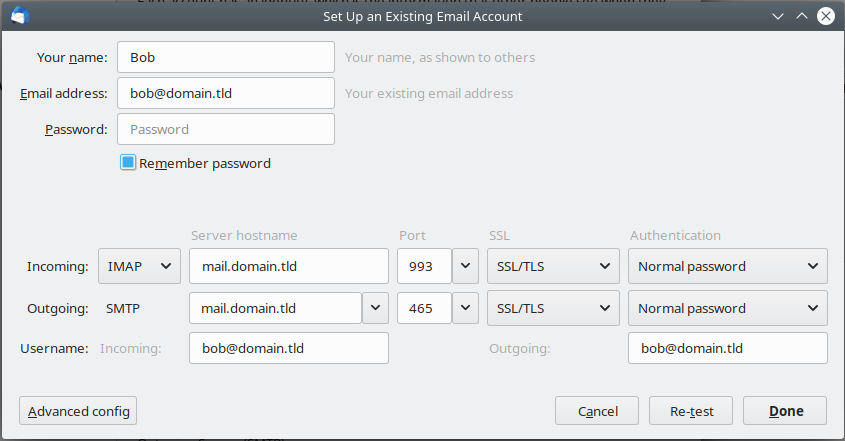

# Mailtainer - All In One Mailserver (IMAP/SMTP)

A mailserver image build on Dovecot, Postfix, Amavis, ClamAV, Spamassassin, 
Letsencrypt. 

## TL;DR;

- Public available image - runs on docker or kubernetes
    - [Demo docker-stackfile.yml](doc/mailtainer-compose.yml)
- AllInOne Yaml Config File
    - [Demo account-config.yml](doc/mailtainer-cfg.yml)
- Out of the box support for Letsencrypt (SSL)
- Setup & ready to go in 60 seconds

## Deployment / Configuration


```bash
sudo apt-get install docker.io curl
sudo mkdir /mailtainer_data
sudo curl -o /mailtainer_data/mailtainer-cfg.yml https://raw.githubusercontent.com/infracamp/mailtainer/master/doc/mailtainer-cfg.yml
sudo curl -o /mailtainer_data/mailtainer-compose.yml https://raw.githubusercontent.com/infracamp/mailtainer/master/doc/mailtainer-compose.yml

## Adjust the files mailtainer-cfg.yml and mailtainer-compose.yml

sudo docker swam init
sudo docker stack deploy -c /mailtainer_data/mailtainer-compose.yml mailtainer  
```

Generating hashed passwords:

```bash
mkpasswd -m SHA-512 <password>
```

### Configuration

| Environment Name | Default | Description |
|------------------|-------------|---------|
| `MAILNAME`       | --          | The hostname this server is running on                           |
| `CONFIG_FILE`    | `/data/mailtainer-cfg.yml` | The path to the config file inside the container  |
| `RBL_CLIENT`     | `sbl-xbl.spamhaus.org;dnsbl.sorbs.net` | RBL hosts |
| `ENABLE_LETSENCRYPT` | 1   | Enable automatic acquiring / renewing of SSL certificates |

## Mail-Client Settings

### Mozilla Thunderbird




## Debugging

- [SMTP DNS Settings Checklist](doc/checklist-mail-config.md)


## Images

| Image                            | Description                                |
|----------------------------------|--------------------------------------------|
| `infracamp/mailtainer:1.0`       | Stable build. Recent updates               |
| `infracamp/mailtainer:1.0.x`     | Release build. Fixed version (no updates)  |
| `infracamp/mailtainer:1.0-dev`   | Development build. Testing only            |

## Backup & Recovery

Mailtainer comes with an http backup utility. It encrypts the
data directory with pgp. To enable backups, fist create a pgp keypair


### Create a pgp key pair

```
gpg --gen-key
gpg --output /mailtainer_data/public.pgp --armor --export your_email@domain.tld
gpg --output backupkeys.pgp --armor --export --export-options export-backup your_email@domain.tld
```

| Environment                       | Default               | Description    |
|-----------------------------------|-----------------------|--------------------|
| `BACKUP_PGP_PUBLIC_KEY_FILE`      | `/data/public.pgp`    | Specify the full path to public.pgp inside the container | 
| `BACKUP_AUTH_PASS_HASH`           | (required)            | specify the crypted (`mkpasswd -m SHA-512`) password to use for basic auth |

> To pass environment including "$"-character you have to double it (replace "$" to "$$")! 
> (See [variable substituion](https://docs.docker.com/compose/compose-file/#variable-substitution) for more information)

### Download the backup via curl

```
curl -fo /backup/location/backup.enc -u backup:<plain_auth_pass> http://mail.server.tld/export.php
```

[Example backup script](doc/backup-script.sh)

### Restore from backup

Import the private key
```
gpg --import backupkeys.pgp
```

Extract the data

```
gpg -d backup-file.enc | tar -xz
```


