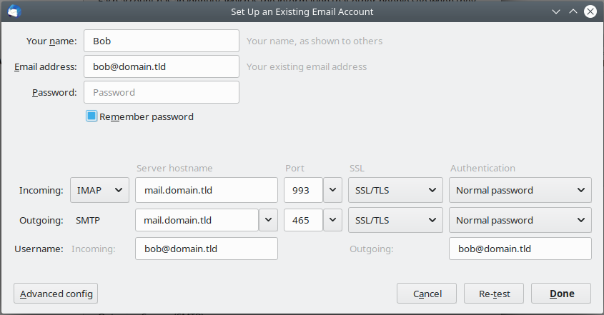

# Mailtainer - All In One Mailserver (IMAP/SMTP)

A mailserver image build on Dovecot, Postfix, Amavis, ClamAV, Spamassassin, 
Letsencrypt. 


## TL;DR;

- Public available image - runs on docker or kubernetes
    - [Demo docker-stackfile.yml](doc/mailtainer-compose.yml)
- AllInOne Yaml Config File
    - [Demo account-config.yml](doc/mailtainer-cfg.yml)
- Out of the box support for Letsencrypt (SSL)
- Setup & ready to go in 60 seconds

## Deployment / Configuration


```bash
sudo apt-get install docker.io curl
sudo mkdir /mailtainer_data
sudo curl -o /mailtainer_data/mailtainer-cfg.yml https://raw.githubusercontent.com/infracamp/mailtainer/master/doc/mailtainer-cfg.yml
sudo curl -o /mailtainer_data/mailtainer-compose.yml https://raw.githubusercontent.com/infracamp/mailtainer/master/doc/mailtainer-compose.yml

## Adjust the files mailtainer-cfg.yml and mailtainer-compose.yml

sudo docker swam init
sudo docker stack deploy -c /mailtainer_data/mailtainer-compose.yml mailtainer  
```

Generating hashed passwords:

```bash
mkpasswd -m SHA-512 <password>
```

### Configuration

| Environment Name | Default | Description |
|------------------|-------------|---------|
| `MAILNAME`       | --          | The hostname this server is running on                           |
| `CONFIG_FILE`    | `/data/mailtainer-cfg.yml` | The path to the config file inside the container  |
| `RBL_CLIENT`     | `sbl-xbl.spamhaus.org;dnsbl.sorbs.net` | RBL hosts |
| `ENABLE_LETSENCRYPT` | 1   | Enable automatic acquiring / renewing of SSL certificates        |
| `ENABLE_DKIM`        | 0   | Enable DKIM signing using OpenDKIM                               |
| `DKIM_SELECTOR`      | `mail` | DKIM selector used for `<selector>._domainkey.<domain>`       |
| `DKIM_PRIVATE_KEY_FILE` | `/run/secrets/dkim_private_key` | Path to the Docker secret containing the DKIM private key |
| `DEBUG`              | 0   | Set to 1 to enable debug logging (may contain sensitive data)    |
| `VALIDATION_ERROR`   | `fail` | `fail` aborts startup on invalid SPF/DKIM/DMARC, `ignore` only logs warnings and continues |

### DKIM

Enable DKIM signing with one Docker secret containing only the private key:

```bash
opendkim-genkey -b 2048 -s mail -d example.org
docker secret create dkim_private_key mail.private
```

Add the secret and environment variables to the service:

```yaml
services:
  mailtainer:
    environment:
      - "ENABLE_DKIM=1"
      # Must match the DNS record: <selector>._domainkey.<domain>
      - "DKIM_SELECTOR=mail"
      - "DKIM_PRIVATE_KEY_FILE=/run/secrets/dkim_private_key"
    secrets:
      - dkim_private_key

secrets:
  dkim_private_key:
    external: true
```

The public key is regenerated from the private key on every container start and printed to the log. Add the printed TXT record for every outgoing sender domain:

```text
mail._domainkey.<domain> TXT "v=DKIM1; k=rsa; p=..."
```

Also add SPF and DMARC records for every mail domain, for example:

```text
<domain>        TXT "v=spf1 mx -all"
_dmarc.<domain> TXT "v=DMARC1; p=reject"
```

Use `p=none` while testing.

On startup the container validates SPF, DKIM and DMARC DNS records for all domains in `mailtainer-cfg.yml`. If a required record is missing or the DKIM key does not match, startup aborts with a detailed error message.

Set `VALIDATION_ERROR=ignore` to only print warnings and continue startup even if one or more domains are misconfigured.


## Mail-Client Settings

### Mozilla Thunderbird



## Debugging

- [SMTP DNS Settings Checklist](doc/checklist-mail-config.md)

## Images

Docker Images are availabe on [Github-Packages](https://github.com/infracamp/mailtainer/pkgs/container/mailtainer)

| Image                                   | Description                                |
|-----------------------------------------|--------------------------------------------|
| `ghcr.io/infracamp/mailtainer:1.0`      | Stable build. Recent updates               |
| `ghcr.io/infracamp/mailtainer:1.0.x`    | Release build. Fixed version (no updates)  |
| `ghcr.io/infracamp/mailtainer:unstable` | Development build. Testing only            |

> To pass environment including "$"-character you have to double it (replace "$" to "$$")! 
> (See [variable substituion](https://docs.docker.com/compose/compose-file/#variable-substitution) for more information)

## Block IP Addresses using iptables

You can't use ufw to block traffic to docker containers directly.
Use the ufw forward rule instead.

```
iptables -I FORWARD -s <ip>/24 -j DROP
```
